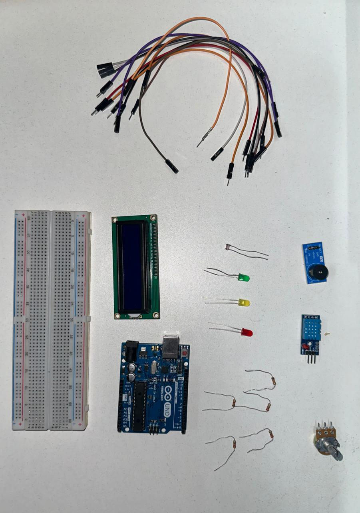

# CP2 - EDGE

## Sobre o projeto
Este projeto consiste em um sistema de controle de ambiente utilizando Arduino para a Vinheria Agnello. O Arduino monitora a luminosidade, temperatura e umidade, e exibe os valores em um display LCD. Além disso, o sistema acende luzes indicadoras (verde, amarela e vermelha) e emite um sinal sonoro através de uma buzina, dependendo das condições do ambiente.

### Funcionalidades
- Monitoramento da luminosidade, temperatura e umidade
- Exibição dos valores monitorados em um display LCD
- Indicação visual com luzes (verde, amarela e vermelha) conforme as condições do ambiente
- Sinal sonoro emitido pela buzina em caso de condições críticas

## Componentes Utilizados

 
  

- Leds Verde, Amarelo, Vermelho
- Modulo de som Buzzer
- Placa de ensaio
- Arduino UNO R3
- Cabos jumpers
- Potenciômetro
- Resistores
- Display
- DHT11
- LDR
<h3>Principais componentes</h3>

Principais componentes para a captação de informações do ambiente neste projeto incluem:
- Fotoresistor LDR: O Fotoresistor LDR é um dispositivo que se destaca pela sua capacidade de ajustar sua resistência conforme a luz incidente sobre ele. Quando exposto à luz, a resistência do LDR diminui, e quando a luminosidade diminui, sua resistência aumenta. Essa característica permite a detecção precisa da luminosidade no ambiente, desempenhando um papel fundamental neste projeto.

- DHT (Sensor Digital de Umidade e Temperatura): O DHT é um sensor multifuncional projetado para medir tanto a umidade quanto a temperatura do ambiente. Sua estrutura inclui um sensor de umidade e um termistor, que é um tipo de resistor sensível à temperatura. O DHT converte as variações na umidade e na temperatura em sinais elétricos, facilitando sua leitura por microcontroladores e outros dispositivos eletrônicos. Com essa capacidade de medição dupla, o DHT é essencial para a obtenção de dados precisos sobre as condições ambientais neste projeto.

## Imagem do projeto Wolwi (Clique na imagem para acessar o projeto no wolwi)

